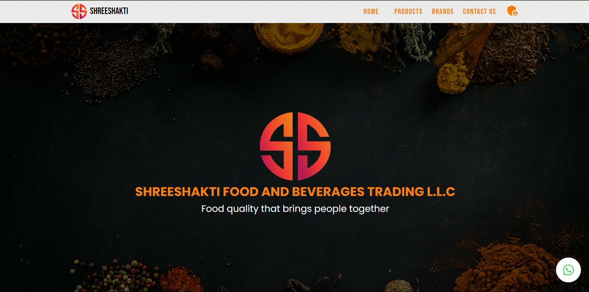

<!--
**ankitBytes/ankitBytes** is a ✨ _special_ ✨ repository because its `README.md` (this file) appears on your GitHub profile.

Here are some ideas to get you started:

- 🔭 I’m currently working on ...
- 🌱 I’m currently learning ...
- 👯 I’m looking to collaborate on ...
- 🤔 I’m looking for help with ...
- 💬 Ask me about ...
- 📫 How to reach me: ...
- 😄 Pronouns: ...
- ⚡ Fun fact: ...
-->

  

  

<h2>A passionate Computer Science final year student at Silicon University.</h2>

  🚀 Ankit Kumar Sahu - Aspiring Engineer & Full-Stack Web Developer

👨‍🎓 Pursuing a Bachelor of Technology (BTech) degree at SIT, I am obsessed on engineering and web development. 🌐

💼 Freelance Full-Stack Web Developer 💼

As a committed and enthusiastic full-stack internet developer, I even have honed my talents in growing dynamic and user-pleasant websites. 💻 My freelance adventure has not only allowed me to use school room understanding in actual-global projects however also provided me with the possibility to collaborate with clients from numerous industries. 🌟

🔧 Skills & Expertise 🔧

I am properly-versed in a range of technologies and equipment, consisting of:

->Front-end: HTML, CSS, JavaScript, React.Js 
->Back-end: Node.Js, Express.Js 
->Databases: MongoDB, SQL 
->Version Control: Git 
->Problem Solving: Data Structures & Algorithms 
📚 Academic Pursuits 📚

While I thrive inside the rapid-paced world of internet improvement, I am also dedicated to my educational journey. My BTech software at SIT BBSR has ready me with a robust basis in computer science and engineering principles. 📖

🌟 Future Goals 🌟

Looking ahead, I aspire to keep increasing my capabilities in web development and exploring new technologies. I am eager to contribute my knowledge to progressive initiatives, collaborate with like-minded professionals, and make a advantageous impact at the tech enterprise.

📧 Let's Connect 📧

I'm usually open to networking and collaborating on thrilling projects. Feel free to reach out to me at sahuankitkumar60@gmail.Com to talk about potential opportunities or truly join. 🤝

   

   

While working as a Freelancer, I got to know about so many ney things, like how we can utilize the component feature of react, how useState works, how we can host a webpage and many more. I learnt react while I got a job from a company reagrding a static webpage for their company.

 

Below is my first projects Glimpse and on clicking the image it will redirect you to the webpage

   

